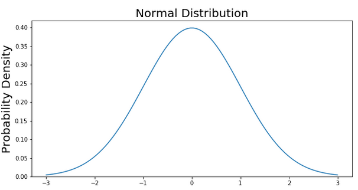

# 数据分析和可视化类

## Understanding Boxplots

- Url: https://towardsdatascience.com/understanding-boxplots-5e2df7bcbd51

1. 什么是箱线图

   

   箱线图以五个数值为基础展示了数据分布：

   - 中位数（median），Q2或50%
   - 第一四分位（Q1）,25%,
   - 第三四分位（Q3，75%）
   - 四分位距：IQR(INTERQUARTILE RANGE)
   - 须线：图中蓝色线
   - 离群值（outliers）
   - 最大值：Q3 + 1.5*IQR
   - 最小值：Q1-1.5*IQR

2. 箱线图与正态分布


-------

## Explaining the 68-95-99.7 rule for a `Normal Distribution

- URL：https://towardsdatascience.com/understanding-the-68-95-99-7-rule-for-a-normal-distribution-b7b7cbf760c2

```
# Import all libraries for the rest of the blog post
from scipy.integrate import quad
import numpy as np
import matplotlib.pyplot as plt

x = np.linspace(-3, 3, num = 100)

constant = 1.0 / np.sqrt(2*np.pi)
pdf_normal_distribution = constant * np.exp((-x**2) / 2.0)

fig, ax = plt.subplots(figsize=(10, 5));
ax.plot(x, pdf_normal_distribution);
ax.set_ylim(0);
ax.set_title('Normal Distribution', size = 20);
ax.set_ylabel('Probability Density', size = 20);
```



```
# Make a PDF for the normal distribution a function
def normalProbabilityDensity(x):
    constant = 1.0 / np.sqrt(2*np.pi)
    return(constant * np.exp((-x**2) / 2.0) )

# Integrate PDF from -1 to 1
result, _ = quad(normalProbabilityDensity, -1, 1, limit = 1000)
print(result)
```


另外一篇参考：为什么正态分布重要（https://medium.com/fintechexplained/ever-wondered-why-normal-distribution-is-so-important-110a482abee3）