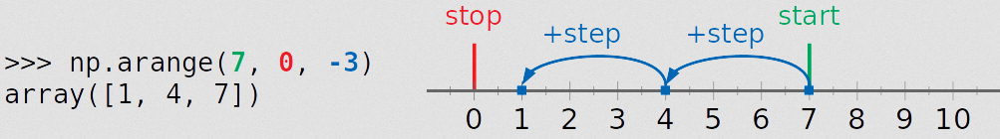

# How to use np.arange()

https://realpython.com/how-to-use-numpy-arange/

```shell
numpy.arange([start, ]stop, [step, ], dtype=None) -> numpy.ndarray
```

1. **start** is the number (integer or decimal) that defines the first value in the array.
2. **stop** is the number that defines the end of the array and isn’t included in the array.
3. **step** is the number that defines the spacing (difference) between each two consecutive values in the array and defaults to `1`.
4. **dtype** is the type of the elements of the output array and defaults to `None`.

注意，stop的值不包含


参数可以为负数

```
>>> np.arange(-5, -1)
array([-5, -4, -3, -2])
>>> np.arange(-8, -2, 2)
array([-8, -6, -4])
>>> np.arange(-5, 6, 4)
array([-5, -1,  3])
```

如果步长为负数，表示从大到小

```
>>> np.arange(5, 1, -1)
array([5, 4, 3, 2])
>>> np.arange(7, 0, -3)
array([7, 4, 1])
```



```python
>>> np.arange(1, 8, 3)[::-1]
array([7, 4, 1])
>>> np.flip(np.arange(1, 8, 3))    # np.flip可以翻转
array([7, 4, 1])
```

NumPy offers you several integer fixed-sized dtypes that differ in memory and limits:

- **np.int8:** 8-bit signed integer (from `-128` to `127`)
- **np.uint8:** 8-bit unsigned integer (from `0` to `255`)
- **np.int16:** 16-bit signed integer (from `-32768` to `32767`)
- **np.uint16:** 16-bit unsigned integer (from `0` to `65535`)
- **np.int32:** 32-bit signed integer (from `-2**31` to `2**31-1`)
- **np.uint32:** 32-bit unsigned integer (from `0` to `2**32-1`)
- **np.int64:** 64-bit signed integer (from `-2**63` to `2**63-1`)
- **np.uint64:** 64-bit unsigned integer (from `0` to `2**64-1`)

其他操作：

```python
>>> x = np.arange(5)
>>> x
array([0, 1, 2, 3, 4])
>>> 2**x
array([ 1,  2,  4,  8, 16])
>>> y = np.arange(-1, 1.1, 0.5)    # 参数不一定都是整数
>>> y
array([-1. , -0.5,  0. ,  0.5,  1. ])
>>> np.abs(y)
array([1. , 0.5, 0. , 0.5, 1. ])
>>> z = np.arange(10)
>>> np.sin(z)
array([ 0.        ,  0.84147098,  0.90929743,  0.14112001, -0.7568025 ,
       -0.95892427, -0.2794155 ,  0.6569866 ,  0.98935825,  0.41211849])
```


比较range和np.arange

range是Python的内置函数，arange是从属于numpy的函数

range适用于循环中的迭代。arange用于创建数组。

对于range(start, stop, step)，参数必须是整数。

两者返回值不同。

比较运算速度：

```python
>>> import timeit
>>> n = 1
>>> timeit.timeit(f'x = [i**2 for i in range({n})]')
>>> timeit.timeit(f'x = np.arange({n})**2', setup='import numpy as np')
```


This is because NumPy performs many operations, including looping, on the C-level. In addition, NumPy is optimized for working with vectors and avoids some Python-related overhead.

总结：


